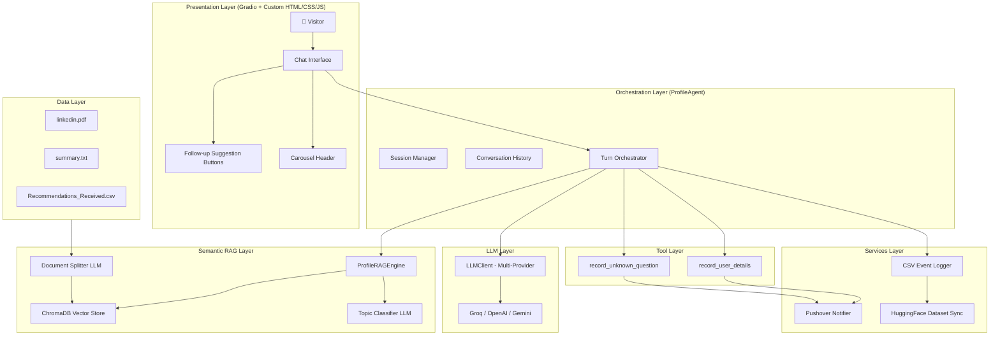
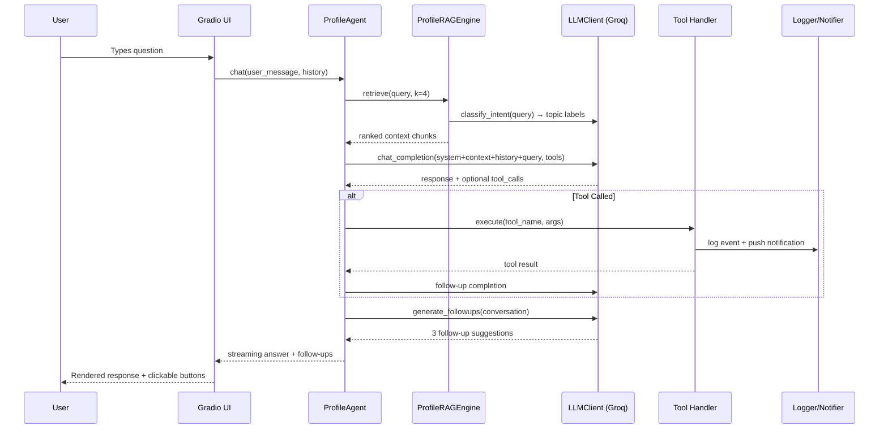
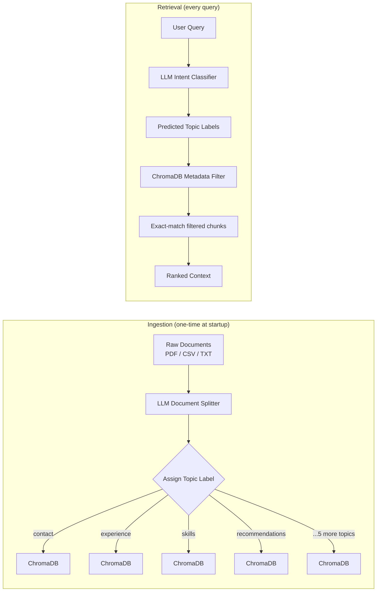
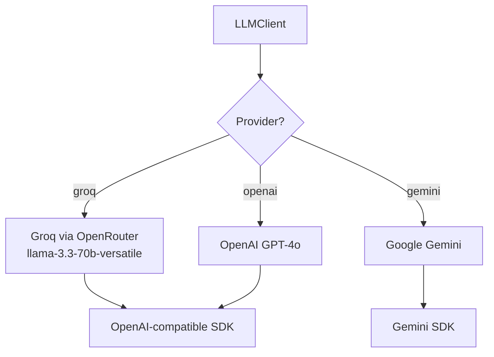
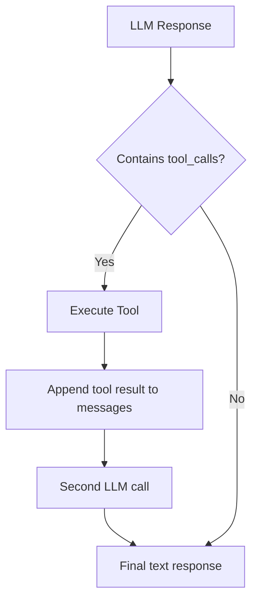
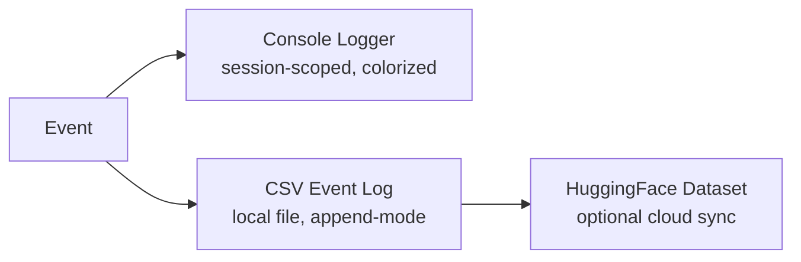
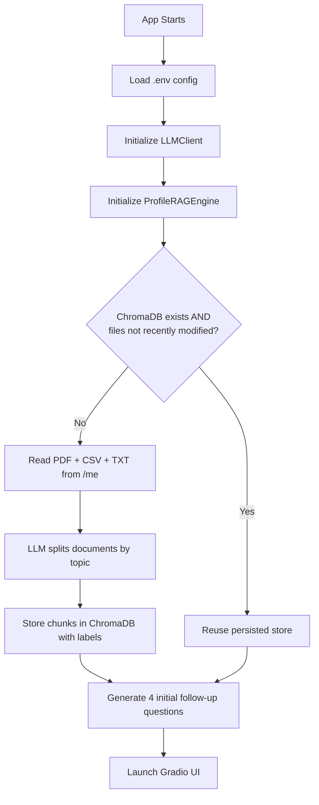
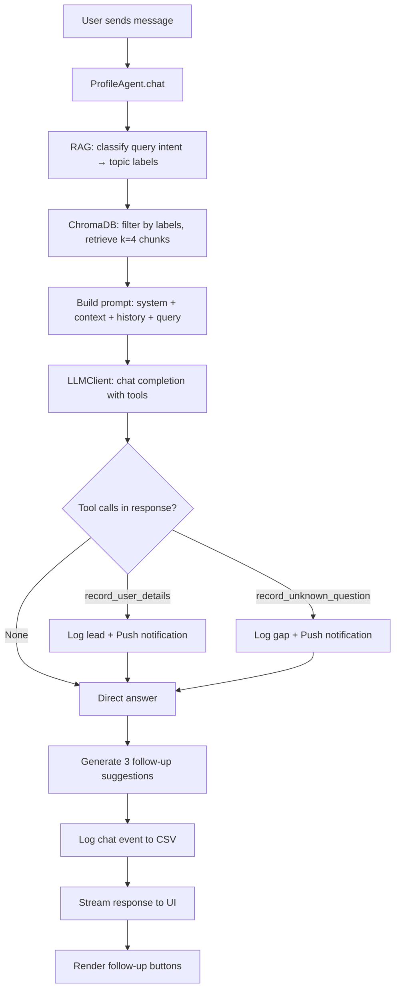

# Profile Assistant AI — Talk to My Resume

> An intelligent, conversational AI that lets anyone explore Archana Shukla's professional journey — experience, skills, achievements, and peer recommendations — through natural language. Try it - https://huggingface.co/spaces/arcshukla/profile_agent

---

## Table of Contents

- [Business Problem](#-business-problem)
- [What It Does](#-what-it-does)
- [Live Demo](#-live-demo)
- [System Architecture](#-system-architecture)
- [Technical Deep Dive](#-technical-deep-dive)
  - [RAG Engine](#rag-engine)
  - [LLM Integration](#llm-integration)
  - [Tool Use](#tool-use)
  - [Logging & Analytics](#logging--analytics)
  - [Notifications](#notifications)
- [UI Design](#-ui-design)
- [Project Structure](#-project-structure)
- [Data Flow](#-data-flow)
- [Configuration & Deployment](#-configuration--deployment)
- [Getting Started](#-getting-started)

---

## 🎯 Business Problem

Traditional resumes and LinkedIn profiles are **static, one-directional, and passive**. A recruiter, hiring manager, or collaborator lands on your profile and must manually scan through dense text to find what they care about — leaving most of their questions unanswered.

**The result:** great candidates get overlooked because their story isn't surfaced in context, and busy stakeholders don't have time to dig.

### What Profile Assistant solves

| Traditional Resume | Profile Assistant AI |
|---|---|
| Static document, no interactivity | Conversational, ask anything |
| Recruiter reads what *you* wrote | Recruiter gets answers to *their* questions |
| One-size-fits-all presentation | Adapts to each visitor's context |
| No feedback loop | Captures unknown questions & leads |
| Disappears after the meeting | Available 24/7, any time zone |

This application turns a professional profile into a **live, intelligent representative** — always on, always accurate, always ready to engage.

---

## ✨ What It Does

- **Conversational Q&A** over resume, LinkedIn profile, and peer recommendations
- **Semantic retrieval** — finds relevant experience/skills/context without keyword matching
- **Guided discovery** — surfaces dynamic follow-up suggestions after every turn
- **Lead capture** — records contact details when a visitor wants to connect
- **Unknown question tracking** — logs what visitors asked that wasn't answered, so the profile can improve
- **Push notifications** — owner gets a real-time alert whenever a lead is captured or a new gap is found
- **Cloud analytics** — every conversation event is logged for review

---

## 🌐 Live Demo

Deployed on HuggingFace Spaces. The assistant is publicly accessible and requires no login from visitors.

---

## 🏗️ System Architecture

### High-Level Overview



### Component Interaction



---

## 🔧 Technical Deep Dive

### RAG Engine

The RAG (Retrieval-Augmented Generation) system is the backbone of the application. Rather than using approximate nearest-neighbor search over undifferentiated text chunks, this application implements a **semantic, topic-aware RAG pipeline**.

#### Architecture — SemanticRAGEngine + ProfileRAGEngine



#### 8-Topic Taxonomy

| Label | What It Covers |
|---|---|
| `contact` | Email, location, LinkedIn URL, phone |
| `summary` | Career narrative, philosophy, leadership style |
| `experience` | Job roles, companies, dates, responsibilities |
| `education` | Degrees, certifications, institutions |
| `skills` | Technical skills, tools, languages |
| `awards` | Recognitions, accomplishments |
| `recommendations` | Peer testimonials and endorsements |
| `other` | Miscellaneous content |

#### Why Not Standard RAG?

Standard RAG embeddings struggle to distinguish *"What are Archana's skills?"* from *"What did recommenders say about Archana's skills?"* — both are semantically similar but should retrieve from different document sections. The topic-label metadata filter solves this cleanly without requiring complex re-ranking.

#### Cache Optimization

Documents are only re-ingested if source files were modified within the last 20 minutes (configurable). Otherwise, ChromaDB's persisted store is reused — keeping startup fast on HuggingFace Spaces.

---

### LLM Integration

#### Multi-Provider Client — `LLMClient`



The client provides a unified interface across providers. Groq is the primary provider (via OpenRouter), chosen for speed and cost. The client handles provider-specific quirks transparently.

#### Groq Compatibility Shim

Groq's API does not support `response_format` + `tools` in the same request. The `LLMClient` detects this and injects the JSON schema as a system-level instruction instead, maintaining structured output without breaking the tool-use loop.

#### Prompts — `agents/profile/prompts.py`

All prompt templates are centralized in one file, making it easy to tune tone, persona, and behavior:

| Prompt | Purpose |
|---|---|
| `SYSTEM_PROMPT` | Core persona: professional, warm, concise |
| `INITIAL_FOLLOWUPS_PROMPT` | Generates 4 seed questions shown on first load |
| `TURN_FOLLOWUPS_PROMPT` | Generates 3 contextual follow-ups after each answer |
| `WELCOME_MESSAGE` | Greeting shown when chat loads |
| `FALLBACK_RESPONSE` | Graceful fallback if LLM fails |

#### Tool-Use Loop

The agent uses OpenAI-style function calling. The LLM decides autonomously whether to invoke tools based on conversation content:



---

### Tool Use

Two tools are registered with the LLM:

#### `record_user_details`

Triggered when a visitor expresses interest in connecting or shares their contact information.

```
Input:  name (str), email (str), notes (str, optional)
Effect: logs to CSV → pushes Pushover notification to owner
```

#### `record_unknown_question`

Triggered when the LLM cannot answer a question from the available profile data.

```
Input:  question (str)
Effect: logs to CSV → pushes Pushover notification → updates metrics
```

Both tools create a **feedback loop** — the owner learns in real time what visitors are asking and what gaps exist in the profile documents.

---

### Logging & Analytics

The logging system writes to three channels simultaneously:



#### Event Types Captured

| Event | When |
|---|---|
| `chat` | Every conversation turn (question + answer + latency) |
| `unknown_question` | When LLM triggers `record_unknown_question` tool |
| `email_capture` | When LLM triggers `record_user_details` tool |
| `debug` | System events (startup, ingestion, errors) |

Every event includes: `session_id`, `timestamp`, `event_type`, `payload`, and performance metadata. This enables analysis of conversation patterns, popular topics, and profile gaps over time.

---

### Notifications

The `Notifier` abstraction wraps Pushover (HTTP push notifications to mobile):

```python
# services/notifier.py
notify(title, message, priority)  # suppressed in IS_LOCAL=true mode
```

The owner receives instant mobile alerts for:
- New lead captured (name + email + notes)
- Unknown question logged (what was asked)
- API errors or ingestion failures

In local development (`IS_LOCAL=true`), all notifications are suppressed.

---

## 🎨 UI Design

The front-end is built with Gradio enhanced by custom HTML, CSS, and JavaScript.

### Visual Structure

```
┌─────────────────────────────────────────────────┐
│           CAROUSEL HEADER                        │
│  [Credentials] [Capabilities] [Testimonial] [CTA]│
│  ←                                             → │
└─────────────────────────────────────────────────┘
┌─────────────────────────────────────────────────┐
│                                                  │
│           CHAT INTERFACE                         │
│                                                  │
│  [Assistant bubble]                              │
│                        [User bubble]             │
│  [Assistant bubble]                              │
│                                                  │
└─────────────────────────────────────────────────┘
┌─────────────────────────────────────────────────┐
│  [Follow-up 1] [Follow-up 2] [Follow-up 3]      │
├─────────────────────────────────────────────────┤
│  [ Type your message...              ] [Send]    │
└─────────────────────────────────────────────────┘
```

### Design Highlights

- **CSS variable theming** — indigo/teal gradient palette, fully adjustable via `:root` variables
- **Animated carousel** — 4 slides rotate every 4.5 seconds; manual navigation with arrows and dot indicators
- **Dynamic follow-up buttons** — re-rendered after every assistant turn; clicking populates the input and auto-submits
- **Auto-scroll** — JavaScript auto-scrolls to the latest message during streaming responses
- **Character counter** — Live 150-char counter on the input field
- **Responsive layout** — Works on desktop and mobile

### Carousel Content

| Slide | Message |
|---|---|
| Credentials | 25 years of engineering leadership |
| Capabilities | Scale teams, build platforms, drive strategy |
| Testimonial | Peer recommendation excerpt |
| Call to Action | "Want to connect? Just ask!" |

---

## 📁 Project Structure

```
profile_agent/
├── app.py                          # Gradio entry point, UI wiring
│
├── agents/
│   └── profile/
│       ├── profile.py              # ProfileAgent — main orchestrator
│       ├── profile_rag.py          # Topic-aware RAG on profile documents
│       └── prompts.py              # All LLM prompt templates
│
├── services/
│   ├── tools.py                    # LLM tool definitions + executor
│   ├── notifier.py                 # Notification abstraction
│   └── pushover_service.py         # Pushover HTTP client
│
├── utils/
│   ├── llm_client.py               # Multi-provider LLM client (Groq/OpenAI/Gemini)
│   ├── semantic_rag_engine.py      # Generic semantic RAG base class
│   ├── rag_pipeline.py             # Legacy embedding-based RAG (reference)
│   ├── logger.py                   # 3-channel logging system
│   ├── metrics.py                  # In-memory metrics singleton
│   └── file_reader.py              # PDF / CSV / TXT file reader
│
├── ui/
│   ├── style.css                   # CSS theming + layout
│   ├── script.js                   # Carousel, auto-scroll, char counter
│   ├── header.html                 # Carousel HTML markup
│   └── profile.jpg                 # Profile photo
│
├── me/                             # Profile source documents (your data)
│   ├── linkedin.pdf
│   ├── summary.txt
│   └── Recommendations_Received.csv
│
├── docs/
│   ├── architecture.md             # Detailed architecture reference
│   └── brd.md                      # Business requirements document
│
├── .chromadb_profile/              # Persisted vector store (auto-created)
├── logs/                           # CSV event logs (auto-created)
├── requirements.txt
├── pyproject.toml
└── .github/workflows/
    └── update_space.yml            # HuggingFace Spaces deployment
```

---

## 🔄 Data Flow

### Startup Sequence



### Per-Turn Data Flow



---

## ⚙️ Configuration & Deployment

### Environment Variables

| Variable | Purpose | Example |
|---|---|---|
| `OPENROUTER_API_KEY` | LLM API key (Groq via OpenRouter) | `sk-or-...` |
| `LLM_MODEL` | Model name | `groq/llama-3.3-70b-versatile` |
| `LLM_BASE_URL` | API base URL | `https://openrouter.ai/api/v1` |
| `PROFILE_NAME` | Name used in system prompt | `Archana Shukla` |
| `PROFILE_FOLDER` | Folder containing profile docs | `me` |
| `PUSHOVER_TOKEN` | Pushover app token | `...` |
| `PUSHOVER_USER` | Pushover user key | `...` |
| `IS_LOCAL` | Suppresses notifications in dev | `true` |
| `LOG_TO_CSV` | Enable CSV event logging | `true` |
| `HF_DATASET_REPO` | HuggingFace dataset for log sync | `user/repo` |
| `CACHE_MINUTES` | Re-ingestion window in minutes | `20` |

### Deployment Targets

| Environment | Behavior |
|---|---|
| **Local** | `IS_LOCAL=true`, notifications suppressed, `share=true` for tunneling |
| **HuggingFace Spaces** | Auto-detected, `share=false`, logs synced to HF dataset |

### HuggingFace Spaces CI/CD

A GitHub Actions workflow ([.github/workflows/update_space.yml](.github/workflows/update_space.yml)) automatically syncs the repository to HuggingFace Spaces on every push to `main`.

---

## 🚀 Getting Started

### Prerequisites

- Python 3.12+
- An OpenRouter API key (or OpenAI / Gemini key)
- Pushover account (optional, for notifications)

### Installation

```bash
git clone https://github.com/your-username/profile_agent.git
cd profile_agent

python -m venv .venv
source .venv/bin/activate   # Windows: .venv\Scripts\activate

pip install -r requirements.txt
```

### Configure

```bash
cp .env.example .env
# Edit .env with your API keys and profile settings
```

### Add Your Profile Documents

Place your documents in the `me/` folder:

```
me/
├── linkedin.pdf          # Export your LinkedIn profile as PDF
├── summary.txt           # A narrative bio or career summary
└── recommendations.csv   # Peer recommendations (LinkedIn export)
```

### Run

```bash
python app.py
```

The app opens at `http://localhost:7860`. On first run, documents are ingested and indexed — this takes 30–60 seconds depending on document size.

---

## 🛠️ Tech Stack

| Layer | Technology |
|---|---|
| **UI Framework** | [Gradio](https://gradio.app/) 6.9+ |
| **Frontend** | Custom HTML / CSS (CSS variables) / Vanilla JS |
| **LLM** | Groq `llama-3.3-70b-versatile` via OpenRouter |
| **LLM SDK** | OpenAI Python SDK (OpenAI-compatible) |
| **Vector Store** | ChromaDB (local persistence) |
| **Document Parsing** | PyMuPDF (PDF), pandas (CSV), built-in (TXT) |
| **Notifications** | Pushover HTTP API |
| **Analytics** | CSV + HuggingFace Dataset |
| **Deployment** | HuggingFace Spaces + GitHub Actions |
| **Language** | Python 3.12+ |

---

## 🧠 Design Decisions

### Why Semantic (Topic-Label) RAG over Embedding Similarity?

Profile documents are small and highly structured. Dense retrieval works best with large corpora where semantic proximity is the right signal. For a resume, what matters is *which section* to retrieve — a topic classifier is more precise and explainable.

### Why Groq + OpenRouter?

Speed. Profile assistant visitors expect instant responses. Groq's inference is significantly faster than hosted OpenAI endpoints, and OpenRouter provides a fallback-capable routing layer with no vendor lock-in.

### Why Tool Use for Lead Capture?

Having the LLM decide *when* to capture a lead is more natural than forcing users through a form. The model reads conversational intent — "I'd love to chat" — and triggers the tool at the right moment, creating a seamless experience.

### Why Centralized Prompts?

All prompts live in `agents/profile/prompts.py`. Persona tuning, tone adjustment, and behavioral changes require editing exactly one file — no hunting across the codebase.

---

*Built with care by Archana Shukla — because your story deserves to be heard.*
